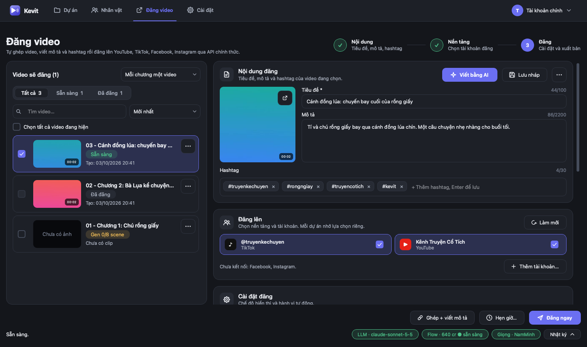
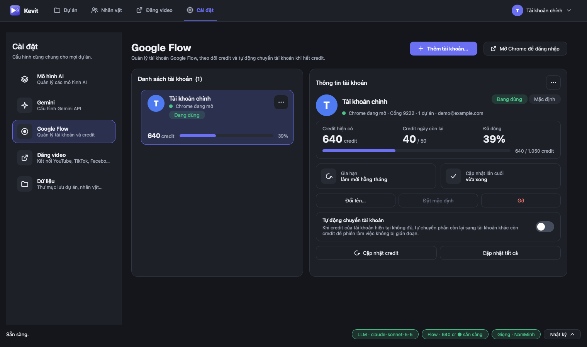
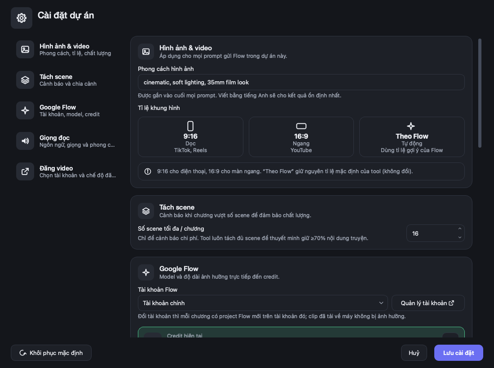
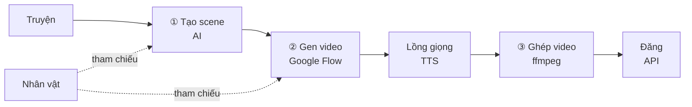

<p align="center">
  
</p>

<h1 align="center">Kevit</h1>

<p align="center">
  <b>Biến truyện chữ thành video kể chuyện có người dẫn, ngay trên máy của bạn.</b><br>
  Tách chương thành scene, giữ nhân vật nhất quán, tạo clip trên Google Flow,<br>
  lồng một giọng đọc xuyên suốt, ghép video và đăng thẳng lên mạng xã hội.
</p>

<p align="center">
  <a href="https://github.com/ytranhn/kevit/releases/latest"></a>
  <a href="LICENSE"></a>
  
  
</p>

<p align="center">
  <a href="https://github.com/ytranhn/kevit/releases/latest"><b>Tải bản mới nhất</b></a> ·
  <a href="#bắt-đầu-nhanh">Bắt đầu nhanh</a> ·
  <a href="#đăng-video">Đăng video</a> ·
  <a href="#xử-lý-sự-cố">Xử lý sự cố</a> ·
  <a href="CHANGELOG.md">Lịch sử thay đổi</a>
</p>

<p align="center">
  
</p>

## Tính năng

- **Tách scene bằng AI.** Dùng Claude, Gemini, OpenAI hoặc dịch vụ tương thích (OpenRouter, DeepSeek, Ollama…). Thuyết minh giữ ít nhất 70% truyện gốc, scene quá dài tự tách nhỏ.
- **Nhân vật nhất quán.** Mỗi nhân vật có ảnh và mô tả, tự nhận diện trong scene và gửi kèm prompt. Nhập theo lô (thư mục ảnh hoặc `.zip`, có thể kèm CSV) hoặc để AI đề xuất từ truyện.
- **Tạo clip trên Google Flow** qua Chrome của chính bạn: mỗi chương một project Flow, nhiều tài khoản (mỗi tài khoản một Chrome và credit riêng), ước tính credit trước khi gen, tự chuyển tài khoản khi hết credit, gen song song, **Đồng bộ Flow** để lấy lại clip đã render mà không tốn credit.
- **Gen nhiều chương một lượt**, tự ghép video khi chương đủ scene, tự đồng bộ Flow khi có scene lỗi.
- **Thuyết minh 15 ngôn ngữ**, giọng Edge TTS miễn phí (300+ giọng) hoặc Gemini TTS, một giọng xuyên suốt dự án.
- **Ghép video** từng chương hoặc cả dự án bằng ffmpeg (đã kèm sẵn).
- **Đăng tự động qua API chính thức** lên YouTube Shorts, TikTok, Facebook Reels, Instagram Reels: AI viết tiêu đề/mô tả/hashtag, nhiều tài khoản mỗi nền tảng, **hẹn giờ**, không đăng trùng.
- Giao diện sáng/tối, macOS và Windows. Xoá gì cũng vào thùng rác và khôi phục được.

**Phím tắt:** `Cmd/Ctrl+F` tìm scene · `Cmd/Ctrl+S` lưu chỉnh sửa · `Cmd/Ctrl+1…4` chuyển tab · `Delete` xoá scene · `Space` phát/dừng xem trước.

## Giao diện

<table>
  <tr>
    <td width="50%"><br><sub><b>Đăng video:</b> chọn video, AI viết mô tả, chọn tài khoản, hẹn giờ.</sub></td>
    <td width="50%"><br><sub><b>Nhân vật:</b> ảnh và mô tả dùng chung cho mọi scene.</sub></td>
  </tr>
  <tr>
    <td width="50%"><br><sub><b>Google Flow:</b> credit từng tài khoản, tự chuyển tài khoản.</sub></td>
    <td width="50%"><br><sub><b>Cài đặt dự án:</b> khổ video, Flow, giọng đọc, đăng video.</sub></td>
  </tr>
</table>

## Bắt đầu nhanh

**Cần có:** macOS hoặc Windows · Google Chrome · tài khoản Google Flow · một khoá API cho bước tách scene (Claude hoặc Gemini).

**Cách 1: bản đóng gói (khuyên dùng).** Tải ở [Releases](https://github.com/ytranhn/kevit/releases/latest), không cần cài Python.

| Hệ điều hành | File | Cài đặt |
|---|---|---|
| macOS | `Kevit.dmg` | Mở file, kéo Kevit vào Applications |
| Windows | `Kevit.zip` | Giải nén, chạy `Kevit.exe` |

> Bản build chưa ký số: lần đầu macOS chọn *chuột phải → Mở*, Windows chọn *Thông tin thêm → Vẫn chạy*.

**Cách 2: chạy từ mã nguồn** (Python 3.10+; Windows dùng `py -m venv .venv` và `.venv\Scripts\...`):

```bash
python3 -m venv .venv
.venv/bin/pip install -r requirements.txt
.venv/bin/python main.py
```

## Cách dùng

1. **Mô hình AI:** *Cài đặt → Mô hình AI* → thêm mô hình, nhập key (hoặc biến môi trường `ANTHROPIC_API_KEY` / `OPENAI_API_KEY` / `GEMINI_API_KEY`), *Lưu và thử kết nối*, rồi *Dùng mô hình này*.
2. **Google Flow:** *Cài đặt → Google Flow* → *Mở Chrome để đăng nhập*, đăng nhập Google **một lần** trong cửa sổ Chrome riêng đó. Kevit chỉ thao tác trên tab Flow.
3. **Nhân vật:** thêm từng nhân vật, *Nhập gói…* theo lô, hoặc *Tạo nhân vật từ truyện (AI)…*.
4. **Dự án:** tạo dự án, dán truyện từng chương vào tab *Truyện*, rồi đi ba bước **① Tạo scene → ② Gen video → ③ Ghép video**. Nhiều chương: *Gen video → Gen nhiều chương…*.
5. **Đăng video:** xem phần dưới.



<details>
<summary><b>Nhập nhân vật theo lô</b></summary>

*Nhập gói…* hoặc kéo-thả thư mục/`.zip` vào tab Nhân vật; có *Tạo gói mẫu…* và bước xem trước. Mỗi ảnh (PNG/JPG/WEBP) là một nhân vật, tên lấy từ tên file; mô tả tuỳ chọn trong `.txt` cùng tên. Muốn thêm vai trò, tên Hán, tên khác: thêm một file `.csv` (chỉ cột **Tên** bắt buộc). Nhân vật trùng tên được cập nhật ảnh nhưng giữ nguyên mô tả bạn đã chỉnh.
</details>

<details>
<summary><b>Credit và nhiều tài khoản Flow</b></summary>

*Cài đặt → Google Flow* hiện credit từng tài khoản (bấm *Cập nhật credit*). Mỗi dự án gắn một tài khoản, đổi ở chip **Flow** dưới cùng. Trước khi gen, Kevit so credit ước tính với credit tài khoản: thiếu thì **không chạy** và cảnh báo. Bật *Tự động chuyển tài khoản* để phần còn lại tự sang tài khoản khác còn credit. Mỗi chương gen trong project Flow riêng «Dự án · Chương»; đổi tài khoản thì chương gen sang project mới trên tài khoản đó.
</details>

<details>
<summary><b>Thuyết minh đa ngôn ngữ</b></summary>

*Cài đặt dự án → Ngôn ngữ thuyết minh*. Tiếng Việt giữ nguyên truyện; ngôn ngữ khác được AI dịch gọn cho vừa 8 giây mỗi scene. Đổi ngôn ngữ giữa chừng, Kevit hỏi có dịch lại và tạo lại giọng không (không tốn credit Flow).
</details>

## Đăng video

1. **Đăng ký ứng dụng (một lần, miễn phí)** trên trang nhà phát triển của từng nền tảng, dán khoá vào *Cài đặt → Đăng video* rồi bấm **Thêm tài khoản** (thêm được nhiều tài khoản mỗi nền tảng; token chỉ lưu trên máy).

   | Nền tảng | Cần | Lưu ý |
   |---|---|---|
   | YouTube | OAuth client *Desktop app* + YouTube Data API v3 | Dự án API chưa được Google duyệt thì video luôn riêng tư; ~6 video/ngày theo hạn mức |
   | TikTok | App có Login Kit + Content Posting API | App chưa duyệt chỉ đăng riêng tư, tài khoản phải là Target User |
   | Facebook | App Meta + Trang bạn quản lý | Reels lên Trang. Bấm **Kết nối bằng token** và dán user token từ *Graph API Explorer* (quyền `pages_show_list`, `pages_manage_posts`, `pages_read_engagement`); «Riêng tư» lưu thành nháp |
   | Instagram | Tài khoản Professional liên kết với Trang | Dùng chung kết nối Meta; chỉ đăng «Công khai» |

2. Tab **Đăng video**: tích các chương, chọn tài khoản (mỗi dự án nhớ riêng) và chế độ hiển thị (nên thử «Riêng tư» trước).
3. **Đăng ngay** (ghép → viết mô tả → đăng), **Ghép + viết mô tả** để xem lại trước, hoặc **Hẹn giờ…**: giờ riêng từng video, hoặc giờ cố định mỗi lần đăng 1 video. Theo dõi ở thẻ **Lịch đăng**.
4. Tuỳ chọn *Tự động đăng khi một chương gen xong* ở Cài đặt dự án.

> **Hẹn giờ chạy trong Kevit:** app phải đang mở và máy không ngủ đúng giờ hẹn. Trễ quá 30 phút thì lượt đó chuyển sang «Lỡ giờ» để bạn đăng ngay, dời giờ hoặc huỷ, không tự đăng bù.

Hãy tuân thủ điều khoản của từng nền tảng, nhất là quy định gắn nhãn nội dung do AI tạo.

## Dữ liệu và bảo mật

- Dữ liệu nằm ngoài ứng dụng nên cập nhật app không làm mất dự án hay đăng nhập: thư mục `data/` khi chạy từ mã nguồn; `~/Library/Application Support/Kevit` (macOS) hoặc `%APPDATA%\Kevit` (Windows) với bản đóng gói. Đổi ở *Cài đặt → Dữ liệu* hoặc biến `VEO_DATA_DIR`.
- Key API và token đăng bài chỉ lưu trên máy bạn, không nằm trong mã nguồn hay bản build, và chỉ được gửi tới đúng dịch vụ tương ứng.
- Kevit chỉ thao tác trên tab Google Flow trong Chrome riêng của nó, không đụng tab khác.

## Xử lý sự cố

| Hiện tượng | Cách xử lý |
|---|---|
| Đã gửi Flow nhưng chưa thấy clip | Clip có thể đang render: bấm **Đồng bộ Flow**, không tốn credit |
| Chrome chưa đăng nhập Flow | *Mở Chrome Flow*, đăng nhập rồi chạy lại |
| Không mở được Chrome (cổng 9222) | Đóng hết cửa sổ Chrome rồi bấm lại *Mở Chrome Flow* |
| Flow báo quá tải (high demand) | Giảm *Số scene gửi cùng lúc* trong Cài đặt dự án, thử lại sau ít phút |
| Gemini tạo ảnh báo hết hạn mức (429) | Key đang ở gói miễn phí: dùng Google Flow (Nano Banana) hoặc bật thanh toán |
| Claude proxy trả phản hồi rỗng | Kiểm tra tên model/quyền key bằng *Lưu và thử kết nối* |
| Lượt hẹn giờ báo «Lỡ giờ» | Kevit đã tắt hoặc máy ngủ quá 30 phút: chọn đăng ngay, dời giờ hoặc huỷ |
| Xoá nhầm dự án, chương, scene | Khôi phục ở *Dự án đã xoá…* hoặc thùng rác của dự án |

## Dành cho nhà phát triển

```text
main.py                điểm vào
app/                   giao diện PySide6, LLM, TTS, ghép video
app/project_parts/     các mixin của tab Dự án       app/publish_parts/  các mixin của tab Đăng video
app/flow_parts/        điều khiển Google Flow        app/widgets/        thành phần giao diện dùng chung
app/publish/           đăng video qua API: OAuth, YouTube, TikTok, Meta, lịch đăng
app/version.py         số phiên bản duy nhất         tests/              114 test, tự cô lập cấu hình và dữ liệu
tools/                 đóng gói, tạo logo, chụp ảnh README (make_docs_images.py)
.github/workflows/     build macOS + Windows khi gắn tag v*
```

```bash
.venv/bin/python -m unittest discover -s tests -t .   # chạy test
.venv/bin/python tools/build_app.py                   # đóng gói vào dist/ (bản trước ở dist/.previous)
```

Mỗi tính năng/bản sửa một nhánh từ `main`. Khi phát hành: sửa `app/version.py` và `CHANGELOG.md`, merge vào `main`, rồi gắn tag `v<phiên bản>` để workflow tự build và tạo release.

## Giấy phép

[MIT](LICENSE): được dùng, sửa và phân phối tự do, giữ nguyên thông báo bản quyền. Phần mềm cung cấp "nguyên trạng", không bảo hành.
