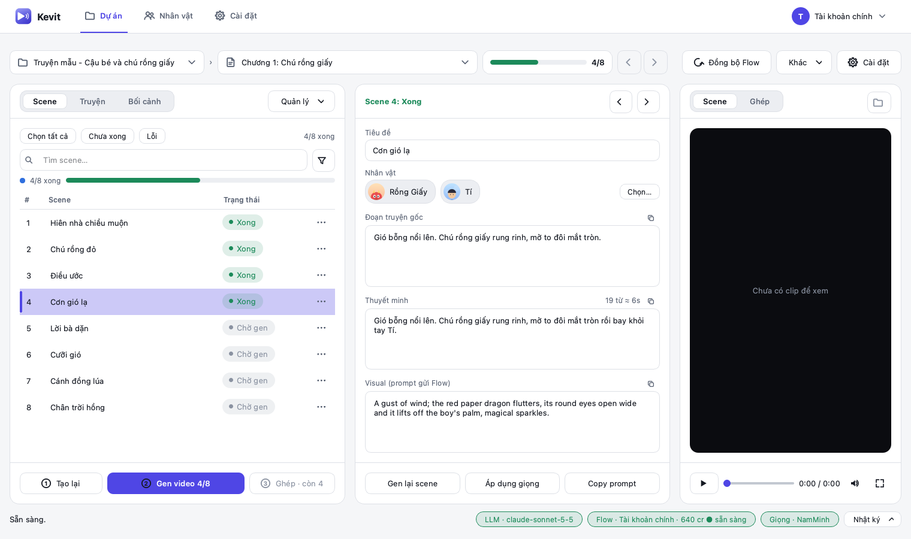
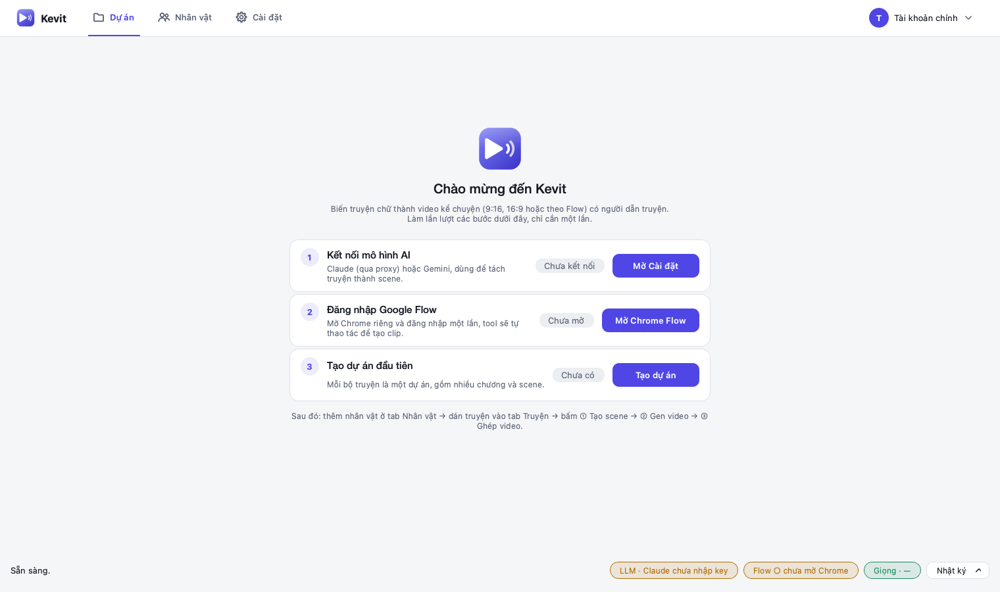
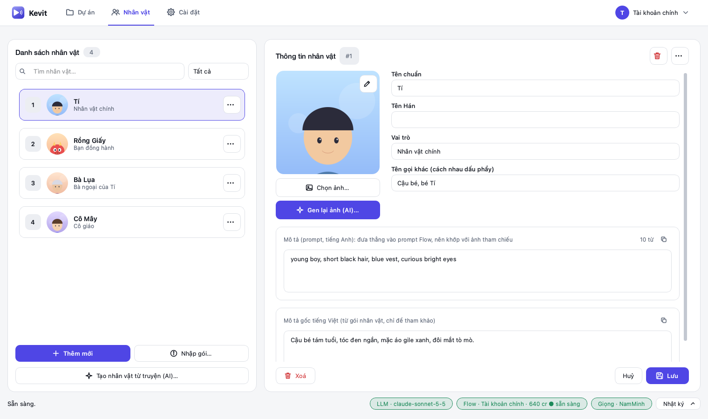
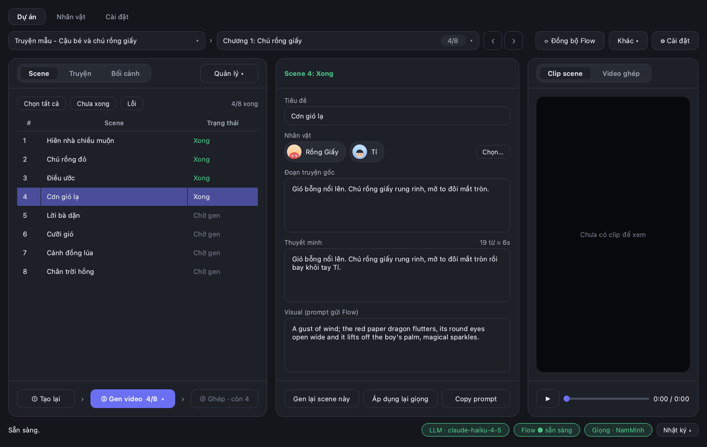

<p align="center">
  
</p>

<h1 align="center">Veo Story Studio</h1>

<p align="center">
  Biến truyện chữ thành <b>video kể chuyện</b> (9:16, 16:9 hoặc theo Flow) có người dẫn truyện, chỉ với vài thao tác.<br>
  Tách chương thành scene · giữ nhân vật nhất quán · tạo clip trên Google Flow · lồng một giọng đọc duy nhất · ghép thành video hoàn chỉnh.
</p>

<p align="center">
  
</p>

## Tính năng

- **Tách scene bằng AI.** Claude (qua proxy hoặc API chính thức) hoặc Gemini chia chương thành các scene ~8 giây, **thuyết minh giữ ít nhất 70% nội dung truyện gốc**. Scene nào quá dài thì tự tách nhỏ.
- **Nhân vật nhất quán.** Mỗi nhân vật có ảnh và mô tả riêng, tự nhận diện trong từng scene rồi gửi ảnh tham chiếu cùng prompt. Nhập hàng loạt từ một "gói nhân vật".
- **Tự động hoá Google Flow.** Điều khiển Chrome của chính bạn: tạo hoặc dùng lại dự án Flow, tải ảnh nhân vật, tạo clip, tải bản gốc về. Đồng bộ lại các clip đã render mà không tốn thêm credit.
- **Một giọng đọc xuyên suốt.** Edge TTS (miễn phí) hoặc Gemini TTS, giọng được lưu bộ nhớ đệm và khớp độ dài với clip.
- **Quản lý theo cấu trúc** Dự án → Chương → Scene → Video: chọn một, nhiều hoặc tất cả scene để tạo; xoá scene, xoá video, xoá chương; gộp scene thông minh; thùng rác để khôi phục.
- **Tiết kiệm.** Ước tính credit trước khi tạo, chọn độ dài clip theo thuyết minh, chỉ gửi những nhân vật có trong chương cho AI.
- **Chọn khổ video:** 9:16 dọc, 16:9 ngang, hoặc **Theo Flow** (giữ nguyên khổ đang chọn trong Flow). Đổi trong *Cài đặt dự án → Hình ảnh & video*.
- **Giao diện sáng và tối**, tự theo hệ điều hành. Chạy trên macOS và Windows.

## Giao diện

<table>
  <tr>
    <td width="50%"><br><sub><b>Lần đầu mở:</b> các bước thiết lập có trạng thái thật.</sub></td>
    <td width="50%"><br><sub><b>Nhân vật:</b> ảnh, tên Hán, vai trò, mô tả prompt.</sub></td>
  </tr>
  <tr>
    <td colspan="2"><br><sub><b>Chế độ tối.</b></sub></td>
  </tr>
</table>

## Bắt đầu nhanh

**Cách 1: dùng bản đóng gói (không cần cài Python).** Tải file mới nhất ở mục *Actions → Build app → Artifacts* (`.dmg` cho macOS, `.zip` cho Windows).

**Cách 2: chạy từ mã nguồn.**

macOS / Linux:

```bash
python3 -m venv .venv
.venv/bin/pip install -r requirements.txt
.venv/bin/python main.py
```

Windows (PowerShell, cần Python 3.10+ và Google Chrome):

```powershell
py -m venv .venv
.venv\Scripts\pip install -r requirements.txt
.venv\Scripts\python main.py
```

## Cách dùng

1. **Cài đặt:** chọn Claude hoặc Gemini và nhập key (hoặc đặt biến môi trường `ANTHROPIC_API_KEY` / `GEMINI_API_KEY`). Bấm *Lưu và thử kết nối*.
2. **Google Flow:** bấm *Mở Chrome Flow*, đăng nhập Google **một lần** trong cửa sổ Chrome riêng đó. Tool chỉ thao tác trên tab Flow.
3. **Nhân vật:** thêm từng nhân vật (ảnh, mô tả tiếng Anh dùng làm prompt, tên gọi khác) hoặc **Nhập gói…**.
4. **Dự án:** tạo dự án, dán truyện từng chương vào tab *Truyện*, rồi đi lần lượt ba bước:
   **① Tạo scene → ② Gen video → ③ Ghép video.**

### Gói nhân vật

Bấm **Nhập gói…** sẽ mở hộp thoại hướng dẫn từng bước (cấu trúc thư mục, ví dụ CSV, mô tả), có nút **Tạo gói mẫu…** để xem tận mắt và bước **xem trước** trước khi ghi vào dự án.

Thư mục chứa `character_index.csv` (UTF-8, cột `No`, `Tên`, `Tên Trung`, `Vai trò`, `Folder`) và mỗi nhân vật một thư mục `NN_Tên/` gồm ảnh và `description.md` (mục `## Mô tả ngoại hình`). Tool ghép theo tên: cập nhật ảnh, vai trò, tên Hán, mô tả gốc; **giữ nguyên** mô tả prompt và tên gọi khác bạn đã chỉnh.

## Dữ liệu và bảo mật

- Chạy từ mã nguồn: dữ liệu ở `data/` (đã nằm trong `.gitignore`). Bản đóng gói: `~/Library/Application Support/Veo Story Studio` (macOS) hoặc `%APPDATA%\Veo Story Studio` (Windows). Đặt biến `VEO_DATA_DIR` để dùng thư mục khác.
- Key API lưu cục bộ trên máy bạn (QSettings), không nằm trong mã nguồn hay bản build.
- ffmpeg lấy từ gói `imageio-ffmpeg`, không cần cài riêng.

## Đóng gói

```bash
.venv/bin/python tools/build_app.py        # Windows: .venv\Scripts\python tools\build_app.py
```

Kết quả ở `dist/` (`.app` + `.dmg` trên macOS, thư mục + `.zip` trên Windows). Phải build trên đúng hệ điều hành đích; workflow `.github/workflows/build.yml` build cả hai trên GitHub. Trên macOS, `tools/make_mac_app.py` tạo gói `.app` nhỏ để Dock hiện đúng tên và biểu tượng khi chạy từ mã nguồn. `tools/make_icon.py` vẽ lại logo.
