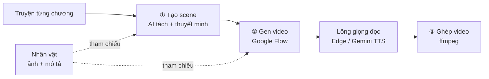

<p align="center">
  
</p>

<h1 align="center">Kevit</h1>

<p align="center">
  <b>Biến truyện chữ thành video kể chuyện có người dẫn, ngay trên máy của bạn.</b><br>
  Kevit (<i>Kể + Vid</i>) tách chương thành scene, giữ nhân vật nhất quán, tạo clip trên Google Flow,<br>
  lồng một giọng đọc xuyên suốt và ghép thành video hoàn chỉnh (9:16, 16:9 hoặc theo Flow).
</p>

<p align="center">
  <a href="https://github.com/ytranhn/kevit/releases/latest"></a>
  <a href="LICENSE"></a>
  
  
</p>

<p align="center">
  <a href="https://github.com/ytranhn/kevit/releases/latest"><b>Tải bản mới nhất</b></a> ·
  <a href="#bắt-đầu-nhanh">Bắt đầu nhanh</a> ·
  <a href="#quy-trình-làm-việc">Quy trình</a> ·
  <a href="#xử-lý-sự-cố">Xử lý sự cố</a>
</p>

<p align="center">
  
</p>

## Mục lục

- [Vì sao dùng Kevit](#vì-sao-dùng-kevit)
- [Tính năng](#tính-năng)
- [Giao diện](#giao-diện)
- [Bắt đầu nhanh](#bắt-đầu-nhanh)
- [Quy trình làm việc](#quy-trình-làm-việc)
- [Hướng dẫn chi tiết](#hướng-dẫn-chi-tiết)
- [Dữ liệu và bảo mật](#dữ-liệu-và-bảo-mật)
- [Xử lý sự cố](#xử-lý-sự-cố)
- [Dành cho nhà phát triển](#dành-cho-nhà-phát-triển)
- [Giấy phép](#giấy-phép)

## Vì sao dùng Kevit

Làm video từ một bộ truyện dài thường vỡ ở ba chỗ: nhân vật mỗi cảnh một khác, lời dẫn bị cắt vụn mất ý, và hàng trăm clip rối tung trong một project. Kevit giải quyết từng chỗ:

| Vấn đề | Cách Kevit xử lý |
|---|---|
| Nhân vật đổi diện mạo giữa các cảnh | Mỗi nhân vật có ảnh và mô tả riêng, tự nhận diện trong từng scene và gửi ảnh tham chiếu kèm prompt |
| Lời dẫn bị cắt xén quá tay | Thuyết minh **giữ ít nhất 70% nội dung truyện gốc**, scene nào quá dài thì tự tách nhỏ |
| Giọng đọc mỗi clip một kiểu | Một giọng duy nhất xuyên suốt dự án, lồng sau khi clip render xong |
| Truyện dài làm Flow chậm | Mỗi chương một project Flow riêng, danh sách dự án/chương có tìm kiếm |
| Tốn credit vì thao tác nhầm | Ước tính credit trước khi tạo, đồng bộ lại clip đã render mà không tốn thêm |

## Tính năng

**Từ truyện đến scene**
- **Tách scene bằng AI, nhiều mô hình.** Thêm bao nhiêu mô hình tuỳ ý (Claude qua proxy hoặc API chính thức, Gemini, OpenAI và mọi dịch vụ theo chuẩn OpenAI như OpenRouter, DeepSeek, Ollama chạy trên máy) và đổi nhanh ở chip LLM; mô hình đang dùng chia chương thành các scene khoảng 8 giây.
- **Quản lý theo cấu trúc** Dự án → Chương → Scene → Video: chọn một, nhiều hoặc tất cả scene để tạo; gộp scene thông minh; xoá scene, video, chương hoặc cả dự án, tất cả đều vào thùng rác và khôi phục được.

**Nhân vật nhất quán**
- **Nhập nhân vật theo lô.** Một thư mục ảnh hoặc file `.zip`, có hoặc không có bảng CSV; một nhân vật lỗi không làm hỏng cả lô và tool báo rõ lý do. Kéo-thả thẳng vào tab Nhân vật.
- **Tạo nhân vật từ truyện (AI).** AI đọc bối cảnh và các chương, đề xuất nhân vật kèm mô tả ngoại hình theo phong cách dự án, có xác định giới tính và đối chiếu số lần nhắc, câu trích trong truyện.
- **Tạo ảnh tham chiếu** bằng Google Flow (Nano Banana, thường 0 credit) hoặc Gemini API.

**Tạo clip trên Google Flow**
- **Tự động hoá qua Chrome của chính bạn.** Mỗi chương một project Flow riêng (đặt tên «Dự án · Chương»), tải ảnh nhân vật, tạo clip, tải bản gốc về.
- **Nhiều tài khoản Google Flow.** Mỗi tài khoản có cửa sổ Chrome, đăng nhập và credit riêng (mở song song được); mỗi dự án gắn một tài khoản, đổi nhanh ở chip Flow dưới cùng hoặc trong Cài đặt dự án.
- **Gen song song.** Gửi nhiều scene một lượt rồi thu clip về, credit không đổi.
- **Đồng bộ Flow.** Lấy lại clip đã render mà app chưa tải, không tốn credit.
- **Chọn khổ video:** 9:16 dọc, 16:9 ngang, hoặc **Theo Flow**.

**Thuyết minh đa ngôn ngữ**
- Chọn ngôn ngữ thuyết minh: Việt, Anh, Trung, Nhật, Hàn, Pháp, Đức, Tây Ban Nha, Bồ Đào Nha, Ý, Nga, Indonesia, Hindi, Ả Rập, Thái. AI dịch gọn từ truyện gốc đúng ngân sách đọc kịp 8 giây của từng ngôn ngữ.
- Giọng đọc từ **Edge TTS miễn phí** (hơn 300 giọng, 75 ngôn ngữ) hoặc Gemini TTS, lưu bộ nhớ đệm, khớp độ dài với clip.
- Đổi ngôn ngữ giữa chừng: tool hỏi có dịch lại các scene đã có và tạo lại giọng không (không tốn credit Flow).

**Trải nghiệm**
- Giao diện sáng và tối, tự theo hệ điều hành; chạy trên macOS và Windows.
- Danh sách dự án/chương có ô tìm kiếm (gõ không dấu cũng được), mở tức thì dù có hàng trăm mục.
- Mở app nhanh, không bị đứng khi mất mạng hay khi Chrome Flow bận.

## Giao diện

<table>
  <tr>
    <td width="50%"><br><sub><b>Lần đầu mở:</b> các bước thiết lập có trạng thái thật.</sub></td>
    <td width="50%"><br><sub><b>Nhân vật:</b> ảnh, tên Hán, vai trò, mô tả prompt. (Dự án mẫu tự viết, ảnh là hình minh hoạ vẽ bằng mã.)</sub></td>
  </tr>
  <tr>
    <td colspan="2"><br><sub><b>Chế độ tối.</b></sub></td>
  </tr>
</table>

## Bắt đầu nhanh

### Yêu cầu

- macOS hoặc Windows
- **Google Chrome** (Kevit điều khiển một cửa sổ Chrome riêng để làm việc với Google Flow)
- Tài khoản **Google Flow**
- Một khoá API cho bước tách scene: **Claude** (có thể qua proxy) hoặc **Gemini**

### Cách 1: dùng bản đóng gói (khuyên dùng)

Tải bản mới nhất ở mục [**Releases**](https://github.com/ytranhn/kevit/releases/latest), không cần cài Python:

| Hệ điều hành | File | Cài đặt |
|---|---|---|
| macOS | `Kevit.dmg` | Mở file, kéo Kevit vào Applications |
| Windows | `Kevit.zip` | Giải nén, chạy `Kevit.exe` |

> Bản build chưa được ký số, nên lần đầu mở hệ điều hành có thể cảnh báo: macOS chọn *chuột phải → Mở*, Windows chọn *Thông tin thêm → Vẫn chạy*.

### Cách 2: chạy từ mã nguồn

macOS / Linux:

```bash
python3 -m venv .venv
.venv/bin/pip install -r requirements.txt
.venv/bin/python main.py
```

Windows (PowerShell, cần Python 3.10+):

```powershell
py -m venv .venv
.venv\Scripts\pip install -r requirements.txt
.venv\Scripts\python main.py
```

## Quy trình làm việc



1. **Cài đặt:** vào *Cài đặt → Mô hình AI*, thêm mô hình (chọn mẫu Claude, Gemini, OpenAI, OpenRouter, DeepSeek, Ollama…), nhập key (hoặc đặt biến môi trường `ANTHROPIC_API_KEY` / `OPENAI_API_KEY` / `GEMINI_API_KEY`), bấm *Lưu và thử kết nối* rồi *Dùng mô hình này*. Tab Cài đặt chia mục: Mô hình AI · Gemini · Google Flow · Dữ liệu.
2. **Google Flow:** bấm *Mở Chrome Flow*, đăng nhập Google **một lần** trong cửa sổ Chrome riêng đó. Tool chỉ thao tác trên tab Flow.
3. **Nhân vật:** thêm từng nhân vật (ảnh, mô tả tiếng Anh dùng làm prompt, tên gọi khác), nhập theo lô, hoặc để AI đề xuất từ truyện.
4. **Dự án:** tạo dự án, dán truyện từng chương vào tab *Truyện*, rồi đi lần lượt ba bước **① Tạo scene → ② Gen video → ③ Ghép video**.

## Hướng dẫn chi tiết

<details>
<summary><b>Nhập nhân vật theo lô</b></summary>

Bấm **Nhập gói…** (hoặc kéo-thả thư mục / file `.zip` vào tab Nhân vật). Hộp thoại có nút **Tạo gói mẫu…** và bước **xem trước** trước khi ghi.

- **Đơn giản nhất:** một thư mục ảnh (PNG/JPG/WEBP), mỗi ảnh một nhân vật, tên lấy từ tên file (bỏ số thứ tự đầu như `01_`). Mô tả tuỳ chọn trong file `.txt` cùng tên.
- **Thêm vai trò, tên Hán, tên khác:** đặt một file `.csv` bất kỳ tên vào thư mục. Dấu phẩy, chấm phẩy hay tab đều được, UTF-8 hoặc Excel. Chỉ cột **Tên** là bắt buộc; các cột Vai trò, Tên Trung, Ảnh, Mô tả, Tên khác có thể thiếu, tên cột tiếng Việt hoặc Anh.
- Ghép theo tên với nhân vật đang có: cập nhật ảnh và dữ liệu, **giữ nguyên** mô tả prompt và tên gọi khác bạn đã chỉnh.

</details>

<details>
<summary><b>Tạo nhân vật từ truyện (AI)</b></summary>

Tab Nhân vật → **Tạo nhân vật từ truyện (AI)…**: AI đọc bối cảnh và các chương, đề xuất nhân vật **chưa có** trong dự án kèm mô tả ngoại hình (prompt tiếng Anh) theo phong cách dự án. Để kết quả ổn định, truyện dài được đọc từng đoạn rồi gộp; mỗi mục được phân loại (chỉ giữ người, thần, yêu thú; bỏ địa danh, tổ chức, vật phẩm, chức danh), đối chiếu số lần nhắc và câu trích trong truyện, xếp theo số lần nhắc.

Chọn nơi tạo ảnh tham chiếu ở hộp thoại:

- **Google Flow (Nano Banana)** (mặc định): dùng chính tài khoản Flow đã đăng nhập, ảnh nằm trong dự án Flow của bạn, thường **0 tín dụng**, không cần key riêng.
- **Gemini API:** cần key đã bật thanh toán (gói miễn phí không có hạn mức tạo ảnh). Model chọn ở Cài đặt.
- Hoặc **Copy prompt ảnh** để tạo bằng công cụ khác rồi gắn ảnh vào nhân vật.

</details>

<details>
<summary><b>Nhiều tài khoản Google Flow</b></summary>

*Cài đặt → Tài khoản Google Flow* quản lý danh sách tài khoản: thêm, đổi tên, gỡ, đặt tài khoản mặc định cho dự án mới, và **Mở Chrome để đăng nhập** (đăng nhập Google một lần cho từng tài khoản). Mỗi tài khoản dùng một hồ sơ Chrome và một cổng debug riêng (tài khoản chính giữ hồ sơ cũ nên không phải đăng nhập lại).

Mỗi dự án gắn một tài khoản: chọn ở chip **Flow** (thanh dưới cùng) hoặc *Cài đặt dự án → Google Flow → Tài khoản Flow*. Project Flow là của riêng từng tài khoản, nên khi đổi tài khoản, mỗi chương sẽ gen vào project mới trên tài khoản đó; địa chỉ project của tài khoản cũ được cất lại và nạp lại khi bạn đổi về. Clip đã tải về máy không bị ảnh hưởng. Gỡ một tài khoản thì các dự án đang dùng nó chuyển về tài khoản chính.

</details>

<details>
<summary><b>Project Google Flow theo chương</b></summary>

Mỗi chương gen trên một project Flow riêng, tên «Tên dự án · Tên chương», để Flow không phải lọc quá nhiều clip và việc đối soát nhanh hơn; chương nào cũng vậy, kể cả chương đã gen từ bản cũ. Clip cũ nằm trong project chung của dự án vẫn được **Đồng bộ Flow** tìm lại. Ảnh nhân vật dùng project chung của dự án.

</details>

<details>
<summary><b>Thuyết minh đa ngôn ngữ</b></summary>

Cài đặt dự án → chọn *Ngôn ngữ thuyết minh*. Tiếng Việt giữ nguyên truyện; ngôn ngữ khác được AI dịch gọn từ truyện gốc theo ngân sách số từ đọc kịp 8 giây. Danh sách giọng đổi theo ngôn ngữ; lần đầu mở app danh mục giọng Edge được tải ngầm, trong lúc đó app dùng bảng giọng dự phòng nên không bị đứng.

</details>

## Dữ liệu và bảo mật

- **Dữ liệu nằm ngoài ứng dụng**, nên build lại hay cập nhật app **không làm mất** dự án, nhân vật, clip hay đăng nhập Flow.
  - Chạy từ mã nguồn: thư mục `data/` (đã nằm trong `.gitignore`).
  - Bản đóng gói: `~/Library/Application Support/Kevit` (macOS) hoặc `%APPDATA%\Kevit` (Windows).
- **Dùng lại dữ liệu cũ trong bản đóng gói:** lần đầu mở, nếu thấy dữ liệu của bản chạy từ mã nguồn, app hỏi có dùng thư mục đó không (không sao chép). Hoặc vào *Cài đặt → Dữ liệu → Đổi thư mục…* và chọn thư mục chứa `projects`. Đặt biến `VEO_DATA_DIR` để ép một thư mục khác.
- Key API lưu cục bộ trên máy bạn (QSettings), không nằm trong mã nguồn hay bản build.
- Kevit chỉ thao tác trên tab Google Flow trong cửa sổ Chrome riêng của nó (hồ sơ `flow_profile`), không đụng tới các tab khác.
- ffmpeg lấy từ gói `imageio-ffmpeg`, không cần cài riêng.

## Xử lý sự cố

| Hiện tượng | Cách xử lý |
|---|---|
| *Đã gửi lên Flow nhưng chưa thấy clip* | Clip có thể vẫn đang render. Bấm **⟳ Đồng bộ Flow** để lấy lại, không tốn credit |
| *Chrome chưa đăng nhập Google Flow* | Bấm *Mở Chrome Flow*, đăng nhập trong cửa sổ Chrome đó rồi chạy lại |
| Không mở được Chrome (cổng 9222) | Đóng hết cửa sổ Chrome đang mở rồi bấm lại *Mở Chrome Flow* |
| Flow báo quá tải (high demand) | Giảm *Số scene gửi cùng lúc* trong Cài đặt dự án, thử lại sau ít phút; credit được hoàn |
| Tạo ảnh bằng Gemini báo hết hạn mức (429) | Key đang ở gói miễn phí; dùng **Google Flow (Nano Banana)** hoặc bật thanh toán cho key |
| Claude proxy trả phản hồi rỗng | Kiểm tra tên model và quyền của key bằng *Lưu và thử kết nối*; model có suy luận dài nên đổi sang model nhỏ hơn |
| Giọng đọc chỉ có ít lựa chọn | Đang offline: app dùng bảng giọng dự phòng, có mạng sẽ tự tải đủ danh mục |
| Xoá nhầm dự án, chương, scene | Khôi phục ở mục *Dự án đã xoá…* hoặc thùng rác của dự án |

## Dành cho nhà phát triển

```text
main.py            điểm vào ứng dụng
app/               mã nguồn (giao diện PySide6, LLM, Flow, TTS, ghép video)
assets/            logo, biểu tượng
docs/images/       ảnh dùng trong README
tools/             đóng gói (build_app.py), tạo logo, tiện ích macOS
.github/workflows/ build macOS + Windows và phát hành khi gắn tag v*
```

**Đóng gói** trên đúng hệ điều hành đích:

```bash
.venv/bin/python tools/build_app.py        # Windows: .venv\Scripts\python tools\build_app.py
```

Kết quả ở `dist/` (`.app` + `.dmg` trên macOS, thư mục + `.zip` trên Windows); bản trước được giữ ở `dist/.previous`. Trên macOS, `tools/make_mac_app.py` tạo gói `.app` nhỏ để Dock hiện đúng tên và biểu tượng khi chạy từ mã nguồn; `tools/make_icon.py` vẽ lại logo.

**Quy trình đóng góp:** mỗi tính năng hoặc bản sửa một nhánh riêng (`feature/…`, `fix/…`) từ `main`; khi đưa vào `main` thì gắn tag phiên bản (`v1.x`) để workflow tự build và tạo release.

## Giấy phép

[MIT](LICENSE): được dùng, sửa và phân phối tự do, giữ nguyên thông báo bản quyền. Phần mềm cung cấp "nguyên trạng", không bảo hành.

Kevit điều khiển Google Flow qua Chrome của chính bạn: hãy tuân thủ điều khoản dịch vụ của Google và của nhà cung cấp mô hình AI bạn dùng.
